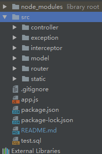
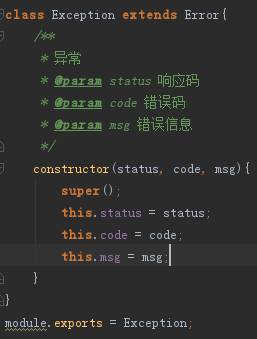

## NodeJS服务器实现-MVC模式（含拦截器、异常处理、控制器路由自动注入）
#### 学习入口：[菜鸟教程Node.js模块](https://www.runoob.com/nodejs/nodejs-tutorial.html)
#### NodeJS的特点
　　1. 它是一个Javascript运行环境

　　2. 依赖于Chrome V8引擎进行代码解释

　　3. 事件驱动

　　4. 非阻塞I/O

　　5. 轻量、可伸缩，适于实时数据交互应用

　　6. 单进程，单线程

#### NodeJS的优缺点

　　优点：

　　1. 高并发（最重要的优点）

　　2. 适合I/O密集型应用

 
　   缺点：

　　1. 不适合CPU密集型应用；CPU密集型应用给Node带来的挑战主要是：由于JavaScript单线程的原因，如果有长时间运行的计算（比如大循环），将会导致CPU时间片不能释放，使得后续I/O无法发起；

　　　　解决方案：分解大型运算任务为多个小任务，使得运算能够适时释放，不阻塞I/O调用的发起；

　　2. 只支持单核CPU，不能充分利用CPU

　　3. 可靠性低，一旦代码某个环节崩溃，整个系统都崩溃

　　　　原因：单进程，单线程

　　　　解决方案：（1）Nnigx反向代理，负载均衡，开多个进程，绑定多个端口；

　　　　　　　　　（2）开多个进程监听同一个端口，使用cluster模块；

　　4. 开源组件库质量参差不齐，更新快，向下不兼容

　　5. Debug不方便，错误没有stack trace

#### NodeJS适用场景

　　1. 实时新闻推送

　　2. 小型项目，快速搭建（例如：论坛，博客等）
    
    

### 应用启动命令（运行前先：npm install）

    node app.js 

### 开发调试使用supervisor，保存即更新

    全局安装：npm -g install supervisor

    启动命令：supervisor app.js

### 目录结构介绍  

    
* package.json 项目的基本信息和第三方node_modules引入配置入口
* app.js主程序入口  
* controller控制器（接口请求配置）  
配置规则：{  
&nbsp;&nbsp;&nbsp;&nbsp;url: '',                    //请求路由  
&nbsp;&nbsp;&nbsp;&nbsp;method: 'get',              //请求方式 get post put patch delete 不写method默认all  
&nbsp;&nbsp;&nbsp;&nbsp;handle: function(req, res){ //处理函数  
&nbsp;&nbsp;&nbsp;&nbsp;}   
}  
  路由匹配规则-`优先匹配`-如果是特殊路由请写在通用路由之前  
  例如：/index 与 /*
* exception异常处理(Exception是异常处理基类，其他自定义异常需继承Exception，具体使用请看代码实现)  

* interceptor拦截器（例如：登录拦截，权限拦截）  
配置规则：{  
&nbsp;&nbsp;&nbsp;&nbsp;url: '',                    //拦截路由，支持正则  
&nbsp;&nbsp;&nbsp;&nbsp;handle: function(req, res, next){ //处理函数，next代表通过拦截  
&nbsp;&nbsp;&nbsp;&nbsp;}  
}  
* model数据层（接入mysql，封装请求工具ndbcTemplate）
* router路由层（主要实现拦截器和控制器自动注入）
* static 静态资源存放目录，直接可访问 